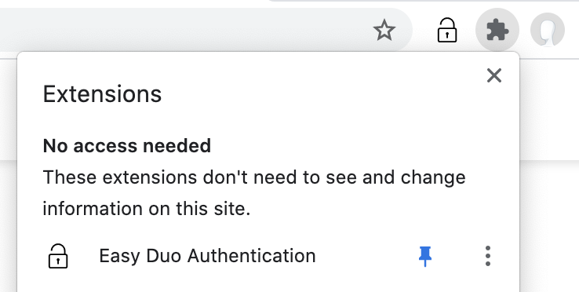
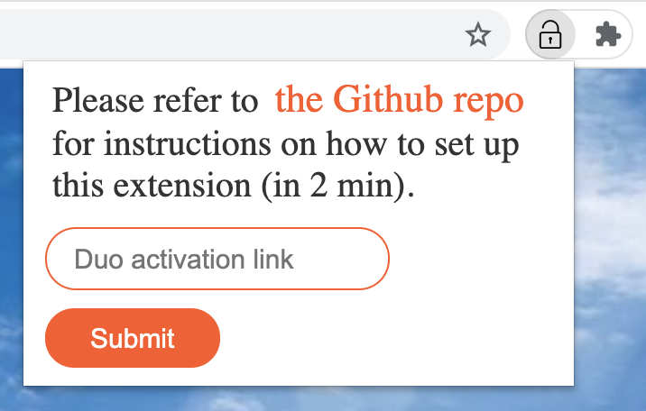
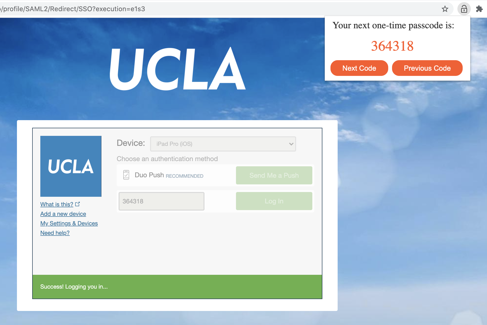

# Easy Duo Authentication

A Chrome extension that allows users to easily authenticate with the Duo Prompt on a computer. 


Initially developed during the UCLA HOTH 8 Hackathon. 

## Overview

[The Duo Authentication](https://guide.duo.com/prompt) uses a one-time password algorithm called [HOTP (HMAC-based One-time Password)](https://tools.ietf.org/html/rfc4226) to generate passcodes. For HOTP, the authenticator and the authenticated share a secret key K (an arbitrary byte string) and a counter C. Each one-time passcode is calculated as such:

```
HOTP(K, C) = truncate(HMACH(K, C))
C += 1
```

Once the authenticated inputs a passcode, the authenticator will verify the passcode by calculating HOTP(K, C) for C in a reasonable interval [C, C+n]. If a match is found, then the authentication succeeds. Therefore, if we manage to get the secret key from Duo, we can calculate the exact same passcodes as Duo would. 

## Set Up
1. Add **Easy Duo Authentication** from the Chrome Web Store (link coming soon). **Pin it** for later convenience. 



If you open the extension, it should look like this. 



2. Open a Duo authentication page, click ```Add a new device```. 


Choose ```Tablet```, choose either ```iOS``` or ```Android```, and click ```Continue```. Then, click ```I have Duo Mobile installed```, and click ```Email me an activation link instead```. Enter your email and **get a one-time activation link** (in the form **https&#8203;://m-x.duosecurity.com/x**). 


 
5. In Chrome, **open the extension** and **input the one-time activation link**. Wait till a "set up successful" message appears. 
6. (Optional) Back to the ```Activate Duo Mobile by Email``` page, click ```Continue```, and change the device name (e.g. to ```Easy Duo Authentication```). 


7. You're all set! Now every time authenticating with Duo, **open the extension to get your passcode**. Regardless of the current device (**it doesn't need to be the one you just added**), paste the passcode and log in. 



## Notes
1. Incorporated ideas/codes from https://github.com/revalo/duo-bypass and https://github.com/jiangts/JS-OTP. 
2. Used CORS Anywhere (https://github.com/Rob--W/cors-anywhere), a reverse proxy that deals with the Cross-Origin Resource Sharing mechanism.
3. Don’t open the extension or click the “Next Code” button for too many times without logging in (i.e., don’t go too ahead of the Duo server), otherwise Duo may not recognize the new passcodes anymore. In this case, click the “Previous Code” button to go back and find the right passcode.
4. If you catch any problems or have any advice, please contact me at y.shen@ucla.edu or sparkshen0807@gmail.com. Thank you so much!
